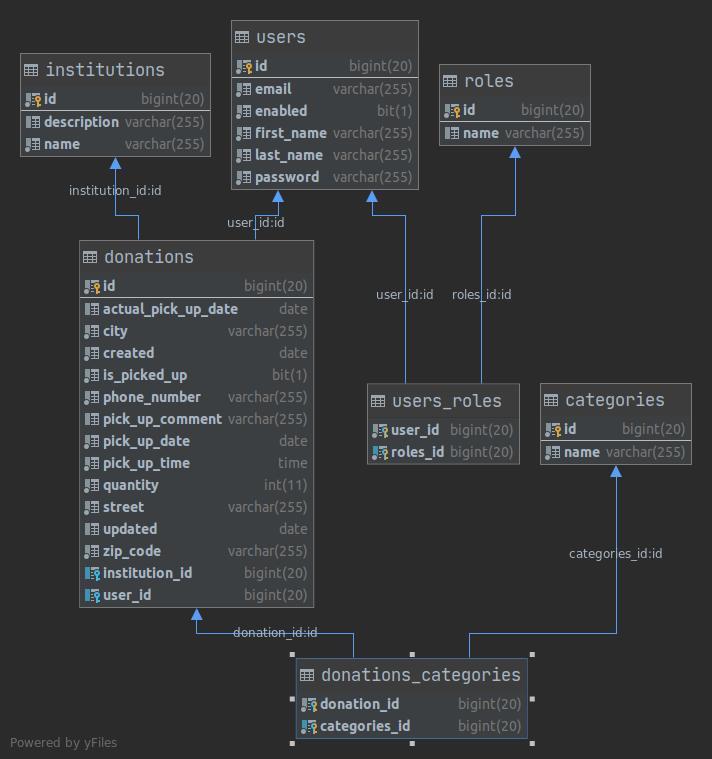

# Charity Application 
>The aim of the project is to create a place where everyone can donate unnecessary things to trusted institutions.                           
## Table of contents
* [General info](#general-info)
* [Technologies](#technologies)
* [Demo version](#demo-version)
* [Features](#features)
* [Status](#status)
* [Contact](#contact)
* [Database structure](#database-structure)
* [Figures](#figures)

## General info 
> The user has things at home that he does not use, but they are in good condition and she/he  
wants to pass them on to people who may need them - but she/he does not know how to easily do it.
When using this application, the user only needs to pack the things to be put in bags, specify their type 
(books, clothes, etc.), choose the foundation, indicate a convenient date and place of collection.
## Technologies
* Spring boot 2.3.3
* Spring data
* Spring Security
* Junit 5 
* Hibernate
* MySQl
* Thymeleaf

## Features

### Ready

#### Landing page
 to encourage the use of the application.
#### Administrator profile:
   * logging in
   * management (CRUD) of administrators,
   * management (CRUD) of trusted institutions,
   * viewing, editing, deleting registered users,
   * an overview of the donations.
#### User profile: 
   * registration with an email confirming the email address, along with a link to activate the account.
   * logging in (the same form as for the administrator),
   * support for forgotten passwords
   * editing your own profile (basic data),
   * adding gifts,
   * viewing, editing donated gifts,
   * an indication that the gift has been given to some foundation (archiving).  

## Status
Project is: _in progress_

## Contact
Created by [@dominika-czycz](https://github.com/dominika-czycz)
 
[dominika-czycz@gmail.com](dominika.czycz@gmail.com) _feel free to contact!_

## Database structure

## Source
Most of the views in application have been prepared by CodersLab for the PortfolioLab.